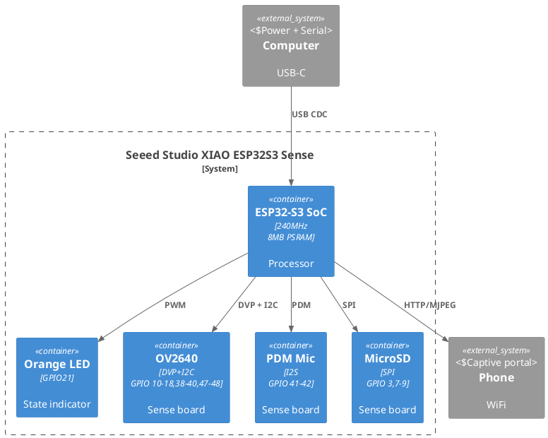

# ESP32-S3 Neural Vision

Edge AI camera with **wake word detection** and **face recognition** — entirely on-device.
Built on **Seeed Studio XIAO ESP32S3 Sense** (8MB PSRAM, OV2640 camera, PDM MEMS mic).

> Status: **Phase 2** — WiFi manager, captive portal, camera streaming, LED indicator, state machine.


---

## Hardware

| Component | Spec |
|---|---|
| MCU | ESP32-S3, Xtensa LX7 dual-core @ 240MHz |
| PSRAM | 8MB (OPI, embedded in SoC) |
| Flash | 8MB QSPI NOR |
| Camera | OV2640 (1600×1200 UXGA, DVP parallel, JPEG hardware) |
| Microphone | MSM261D3526H1CPM digital MEMS (PDM, I2S) |
| Wireless | WiFi 2.4GHz b/g/n + BLE 5.0 |
| Storage | MicroSD slot (SPI mode, up to 32GB) |
| Indicator | Orange LED on GPIO21 (PWM-capable) |
| Board | Seeed Studio XIAO ESP32S3 Sense ([wiki](https://wiki.seeedstudio.com/xiao_esp32s3_getting_started/)) |

### Pinout

#### Main Board (XIAO ESP32S3)

| Pin | GPIO | Function | Notes |
|-----|------|----------|-------|
| D0 | GPIO1 | ADC1/TOUCH1 | |
| D1 | GPIO2 | ADC1/TOUCH2 | |
| D2 | GPIO3 | ADC1/TOUCH3 | Shared with SD CS on Sense |
| D3 | GPIO4 | ADC1/TOUCH4 | |
| D4 | GPIO5 | ADC1/TOUCH5, I2C SDA | |
| D5 | GPIO6 | ADC1/TOUCH6, I2C SCL | |
| D6/TX | GPIO43 | UART0 TX | Strapping pin |
| D7/RX | GPIO44 | UART0 RX | Strapping pin |
| D8 | GPIO7 | ADC2/TOUCH7, SPI SCK | Shared with SD SCK |
| D9 | GPIO8 | ADC2/TOUCH8, SPI MISO | Shared with SD MISO |
| D10 | GPIO9 | ADC2/TOUCH9, SPI MOSI | Shared with SD MOSI |
| — | GPIO21 | USER LED (orange) | Active HIGH, also SD CS |
| 5V | VBUS | Power in/out | USB voltage |
| 3V3 | 3V3_OUT | 700mA max | Regulated output |
| GND | — | Ground | |

#### Sense Expansion Board (Camera + Mic + SD)

**OV2640 camera** (via DVP parallel bus + I2C control):

| Signal | GPIO | Signal | GPIO |
|--------|------|--------|------|
| XCLK | 10 | DVP_Y8 | 11 |
| DVP_PCLK | 13 | DVP_Y7 | 12 |
| DVP_VSYNC | 38 | DVP_Y6 | 14 |
| DVP_HREF | 47 | DVP_Y5 | 16 |
| CAM_SDA | 40 | DVP_Y4 | 18 |
| CAM_SCL | 39 | DVP_Y3 | 17 |
| — | — | DVP_Y2 | 15 |
| — | — | DVP_Y9 | 48 |

**PDM Microphone**: DATA=GPIO41, CLK=GPIO42

**MicroSD** (SPI mode): CS=GPIO3, SCK=GPIO7, MISO=GPIO8, MOSI=GPIO9

> Full pinout: [official Seeed wiki](https://wiki.seeedstudio.com/xiao_esp32s3_pin_multiplexing/) | Use `pins_config.h` in code.

### Wiring Diagram



Render with: `plantuml docs/wiring.puml` ([PlantUML](https://plantuml.com/)).

---

## Architecture

### System Overview

```
USB-C ──→ ESP32-S3 ──→ OV2640 Camera (DVP)
                │
                ├──→ PDM Mic (I2S GPIO 41-42)
                ├──→ Orange LED (GPIO21 PWM)
                ├──→ MicroSD (SPI GPIO 3,7-9)
                └──→ WiFi AP/STA ──→ HTTP Server (port 80)
```

### FreeRTOS Task Layout

```
Core 0 (PRO — Network):  WiFi stack, HTTP Server
Core 1 (APP — Processing): Audio capture, Camera pipeline, ML inference, State machine
```

### State Machine

```
                        ┌──────────────┐
                        │    INIT      │  Hardware init, PSRAM alloc → LED: pulse
                        └──────┬───────┘
                               │
                   Has saved WiFi?
                       /          \
                     YES           NO
                      ↓             ↓
               ┌──────────┐  ┌──────────┐
               │CONNECTING│  │ AP_MODE  │  Captive Portal @ 192.168.4.1
               └────┬─────┘  └────┬─────┘
                    │             │ User sets up WiFi → NVS → reboot
               ┌────▼─────┐       │
               │   IDLE   │◄──────┘  Online, wake word listening
               └────┬─────┘
                    │ wake word detected
               ┌────▼─────┐
               │  ACTIVE  │  Camera + face detection, 30s → IDLE
               └────┬─────┘
                    │
               ┌────▼─────┐
               │  ERROR   │  Auto-recovery 5s
               └──────────┘
```

### Data Flow

```
PDM Mic ──→ I2S ──→ Ring Buffer (PSRAM, 3s) ──→ VAD ──→ Wake Word ML
                                                              │
OV2640 ──→ JPEG Buffer (DRAM) ──→ MJPEG HTTP Stream ──→ Browser Dashboard
                │
                └──→ [future] Face Detection ──→ WebSocket Events
```

### PSRAM Budget (8MB)

| Component | Size | Location |
|---|---|---|
| Audio ring buffer (3s @ 16kHz/16bit) | 96KB | PSRAM |
| Audio processing + MFCC | 40KB | PSRAM |
| TFLite tensor arena | 32KB | PSRAM |
| RGB565 conversion buffer | 307KB | PSRAM |
| Face detection / recognition | 650KB | PSRAM |
| Camera frame buffers (2x) | ~100KB | DRAM |
| FreeRTOS task stacks | ~32KB | DRAM |
| **Headroom** | **~6.7MB** | — |

### Directory Structure

```
esp32/
├── platformio.ini           # Build config (4 environments)
├── README.md
├── docs/
│   ├── demo.gif             # Boot demo
│   ├── wiring.puml          # Wiring diagram (PlantUML)
│   └── pinout.puml          # Pinout diagram (PlantUML)
├── src/
│   ├── main.cpp             # Entry point → SystemManager
│   ├── pins_config.h        # GPIO pin definitions
│   ├── core/
│   │   ├── SystemManager.h  # Orchestrator: init, main loop
│   │   ├── StateMachine.h   # FSM (INIT/AP/CONNECTING/IDLE/ACTIVE/ERROR)
│   │   ├── EventBus.h       # FreeRTOS queue pub/sub
│   │   └── LedIndicator.h   # GPIO21 orange LED (PWM patterns)
│   ├── memory/MemoryManager.h
│   ├── wifi/WifiManager.h
│   ├── wifi/CaptivePortal.h
│   ├── audio/AudioManager.h
│   ├── vision/CameraManager.h
│   ├── server/HttpServer.h
│   ├── storage/ConfigManager.h
│   └── tests/               # Standalone test modules
└── .pio/                    # Build artifacts (gitignored)
```

---

## Quick Start

### Prerequisites

- [PlatformIO IDE](https://platformio.org/install) or CLI (`brew install platformio`)
- USB-C cable
- XIAO ESP32S3 Sense

### Build

```bash
# Full integrated firmware
pio run -e full

# Test individual modules:
pio run -e test_cam     # Camera + WiFi + Stream
pio run -e test_mic     # Microphone recording
pio run -e test_wifi    # WiFi manager + Captive portal
```

### Flash & Monitor

```bash
# Build + upload
pio run -e full -t upload

# Open serial monitor (115200 baud)
pio device monitor -e full
```

> ⚠ If auto-detection picks the wrong port, set `upload_port` in `platformio.ini`.

### First-time Setup (Captive Portal)

1. Flash `full` firmware
2. ESP32 creates AP `ESP32-S3-Setup` (open network)
3. Connect phone/laptop to that AP
4. Captive portal opens at **192.168.4.1**
5. Select your WiFi network, enter password, click **Connect**
6. Device reboots and connects to your WiFi
7. Open dashboard at the IP shown in serial monitor

### Factory Reset

Visit `http://<device-ip>/api/factory-reset` or click the button on the dashboard.

---

## LED Indicator Reference

The onboard orange LED (GPIO21) indicates device state via PWM patterns:

| State | Pattern | Meaning |
|-------|---------|---------|
| INIT | Breathing pulse | Hardware initialization |
| AP_MODE | Slow blink (500ms) | WiFi AP mode, captive portal |
| CONNECTING | Fast blink (150ms) | Connecting to WiFi |
| IDLE | Solid on | Online, ready |
| ACTIVE | Solid on | Wake word triggered, face detection |
| ERROR | Fast blink (150ms) | Error, auto-recovery in 5s |

---

## API Reference

### HTTP Endpoints

| Method | Path | Description |
|---|---|---|
| `GET` | `/` | Dashboard SPA with live status |
| `GET` | `/stream` | MJPEG camera stream |
| `GET` | `/capture` | Single JPEG photo |
| `GET` | `/api/status` | System status (JSON) |
| `GET` | `/api/config` | Configuration (JSON) |
| `GET` | `/api/factory-reset` | Clear WiFi + reboot |
| `POST` | `/api/system/reboot` | Reboot device |

#### `/api/status`

```json
{
  "uptime_ms": 123456,
  "state": "IDLE",
  "psram_free": 6500000,
  "dram_free": 250000,
  "wifi_connected": true,
  "rssi": -52,
  "ip": "192.168.1.100",
  "audio_energy": 341.5
}
```

#### `/api/config`

```json
{
  "wifi_ssid": "MyNetwork",
  "face_threshold": 0.55,
  "wake_threshold": 0.70,
  "stream_enabled": true,
  "cam_resolution": 6
}
```

---

## Build Environments

| Environment | Contents | Use Case |
|---|---|---|
| `full` | All modules | Production firmware |
| `test_cam` | Camera + WiFi + Stream | Verify camera hardware |
| `test_mic` | Audio + serial dump | Verify microphone |
| `test_wifi` | WiFi + CaptivePortal | Verify WiFi setup |

---

## Configuration

Stored in **NVS** via `Preferences` library.

| Key | Type | Default | Description |
|---|---|---|---|
| `wifi_ssid` | string | `""` | WiFi SSID |
| `wifi_pass` | string | `""` | WiFi password |
| `face_thresh` | float | `0.55` | Face recognition threshold |
| `wake_thresh` | float | `0.70` | Wake word confidence |
| `stream_enabled` | bool | `true` | Auto-start stream |
| `cam_res` | int | `6` (HVGA) | Camera resolution code |

---

## Troubleshooting

### Flash fails / "Failed to connect to ESP32-S3"

**Cause**: Wrong serial port auto-detected, or board not in download mode.

**Solutions**:
```bash
# 1. Set port explicitly in platformio.ini:
upload_port = /dev/cu.usbmodem31301

# 2. Enable verbose upload to see the real error:
pio run -e full -t upload --verbose

# 3. Put board in download mode:
#    Hold BOOT → tap RESET → release BOOT

# 4. Try lower baud rate:
upload_speed = 115200
```

### "tcpip_send_msg_wait_sem (Invalid mbox)" crash

**Cause**: WiFi/HTTP stack used before lwIP initialization. Fixed by calling `WiFi.mode(WIFI_AP_STA)` before the HTTP server starts.

### Board boots but no serial output

1. Enable **USB CDC on Boot**: set `-DARDUINO_USB_CDC_ON_BOOT=1` in build flags (already set)
2. Press the **RESET** button once after flash
3. Power-cycle the board (unplug USB, re-plug)

### Onboard LED stays off

**Cause**: GPIO21 is used as LED but also shared with SD card CS on Sense board. If you use the SD card, the LED will flicker during SD operations. The LED is **active HIGH** — try `digitalWrite(21, HIGH)` manually to verify.

### Serial monitor shows garbled text

Check baud rate: must be `115200` to match `monitor_speed` in `platformio.ini`.

### WiFi AP doesn't appear

Some boards boot into download mode after flash. Press **RESET** once. If still missing, hold the BOOT button for 2 seconds, then release.

### "psramInit(): PSRAM enabled" not showing

PSRAM is essential — without it the firmware won't work. Verify:
- `board_build.arduino.memory_type = qio_opi` in `platformio.ini`
- `-DBOARD_HAS_PSRAM` in build flags

### More help

- [ESP32-S3 troubleshooting](https://docs.espressif.com/projects/esptool/en/latest/troubleshooting.html)
- [Seeed XIAO ESP32-S3 forum](https://forum.seeedstudio.com/c/xiao-series/)

---

## Roadmap

- [x] **Phase 1** — Clean architecture, all hardware modules
- [x] **Phase 2** — WiFi manager, captive portal, state machine, LED indicator
- [ ] **Phase 3** — Audio pipeline + wake word detection (TFLite Micro)
- [ ] **Phase 4** — Face detection (ESP-DL MTCNN)
- [ ] **Phase 5** — Web dashboard (full SPA with WebSocket)
- [ ] **Phase 6** — Face recognition + enrollment database
- [ ] **Phase 7** — OTA updates + production polish

---

## License

MIT
