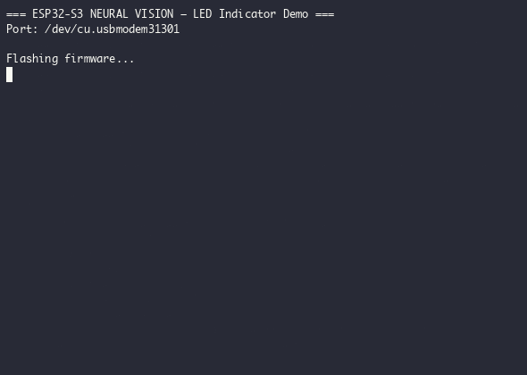
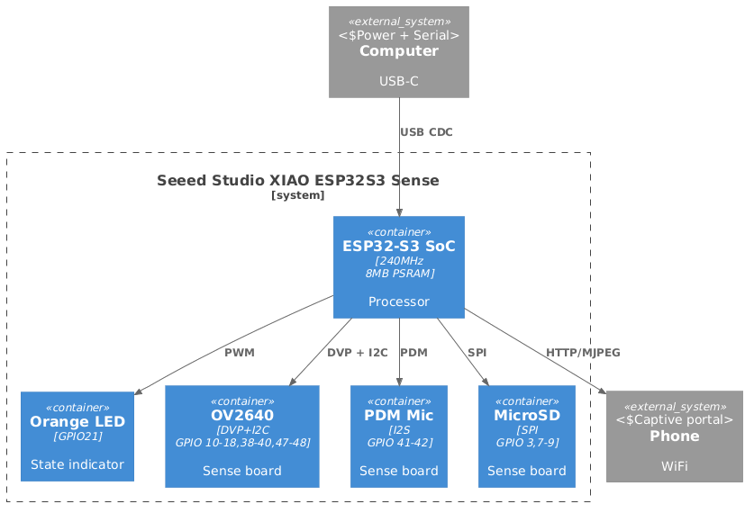

# ESP32-S3 Neural Vision

Edge AI camera with **wake word detection** and **face recognition** — entirely on-device.
Built on **Seeed Studio XIAO ESP32S3 Sense** (8MB PSRAM, OV2640 camera, PDM MEMS mic).

> Status: **Phase 2** — WiFi manager, captive portal, camera streaming, LED indicator, state machine.



---

## Hardware

| Component | Spec |
|---|---|
| MCU | ESP32-S3, Xtensa LX7 dual-core @ 240MHz |
| PSRAM | 8MB (OPI) |
| Flash | 8MB QSPI NOR |
| Camera | OV2640 (1600×1200 UXGA, DVP parallel, JPEG) |
| Microphone | MSM261D3526H1CPM digital MEMS (PDM, I2S) |
| Wireless | WiFi 2.4GHz b/g/n + BLE 5.0 |
| Indicator | Orange LED on GPIO21 (PWM) |
| Board | [Seeed Studio XIAO ESP32S3 Sense](https://wiki.seeedstudio.com/xiao_esp32s3_getting_started/) |

## Wiring



---

## Quick Start

```bash
# Build
pio run -e full

# Flash
pio run -e full -t upload

# Monitor
pio device monitor -e full
```

First boot creates AP **ESP32-S3-Setup** — connect and set up WiFi at 192.168.4.1.

---

## Documentation

| Topic | File |
|---|---|
| Architecture & State Machine | [docs/architecture.md](docs/architecture.md) |
| Pinout & GPIO Tables | [docs/pinout.md](docs/pinout.md) |
| API Reference | [docs/api.md](docs/api.md) |
| Build Environments & Config | [docs/build.md](docs/build.md) |
| Troubleshooting | [docs/troubleshooting.md](docs/troubleshooting.md) |

---

## License

MIT
